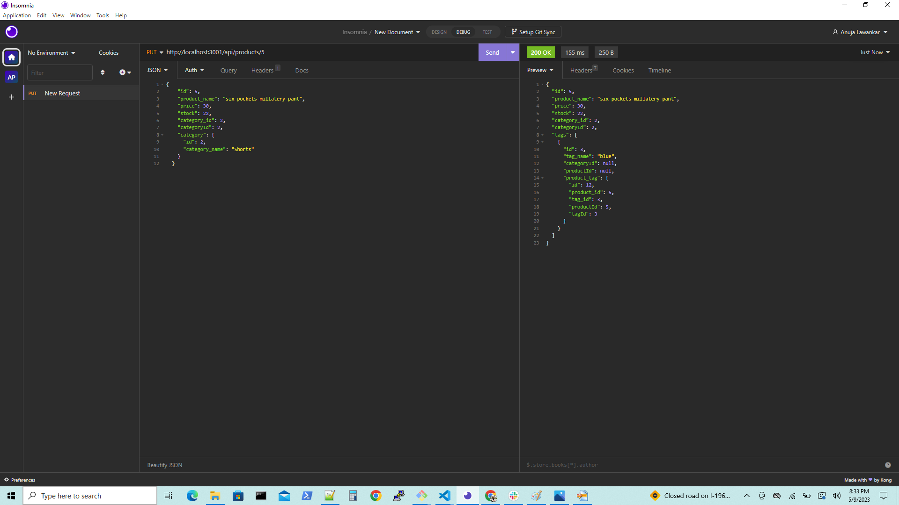
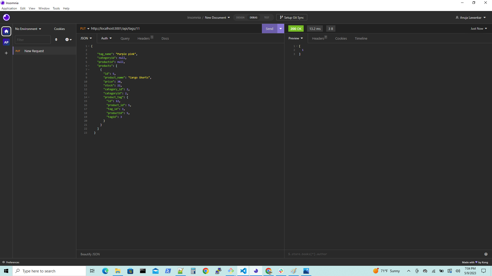

# ORM-E-commerce-Back-End

## Description

1. ORM-E-commerce-Back-End is an e-commerce website that keep track on Categories, Products and Tag.

2. Checking the REST api for routes of Categories, Products and Tag through Insomnia.

3. Database is created by schema and seed commands.

4. While checking REST api the data return is in JSON format.

5. When user test API for POST, PUT, DELETE routes in Insomnia. Then he is successfully create, update and delete data in database.

## Steps followed:-

1. Clone starter code from the remote repository "fantastic-umbrella"  to local repository "ORM-E-commerce-Back-End".

2. Manipulated the code according to the Acceptance Criteria.

3. Created "New Repository" in "GitHub" and named it as, "ORM-E-commerce-Back-End".

4. Uploaded all the files from local repository to "GitHub". The "README" file was already in remote repository.(no need to create)

5. Here, config, db, models, routes, api, seeds,package.json, server.js all these directories and files were already created. Added code in files like Category.js, Product.js, ProductTag.js and Tag.js in models directory.

6. Added code in files likes category-routes.js,product-routes.js, tag-routes.js in routes directory.

7. Navigate to "GitHub" repository "ORM-E-commerce-Back-End" using "Git Bash".

8. Added description, screenshots in  "README"  file.

9. Performed, "add", "commit", "pull", "push", operations on source code.

10. Check all routes in Insomnia.

11.  Deployed and assigned the "URL" to the website.

12. Added screenshot for final website appearance and Git Bash commands.

## URLs:-
Here, you can find the walkthrough video.

https://drive.google.com/file/d/1zPguMJoUpx7zqA5kplLVKQysrMkFdhXE/view

Here, you can find the GitHub URL:-
GitHub URL:- 

https://github.com/AnujaLawankar/ORM-E-commerce-Back-End

## Installation

1. start execution: npm install
2. watch result: nodemon server.js
3. seed data: node seeds/index.js
4. Change and rename the .env file

## Usage

 ORM-E-commerce-Back-End is an e-commerce website that keep track on Categories, Porducts and Tag.

## License

 MIT  License  

## Assets

The following images demonstrates working in insomnia.
1. GET request for Products.

2. GET by id request for Products. 

3. POST command for Products.

4. PUT command for Products.

5. DELETE command for Products.

6. GET command for Categories.

7. GET by id command for Categories.

8. POST command for Categories.

9. PUT command for Categories.

10. DELETE command for Categories.

11. GET command for Tags.

12. GET by id command for Tags.

13. POST command for Tags.

14. DELETE command for Tags.

15. PUT command for Tags.

